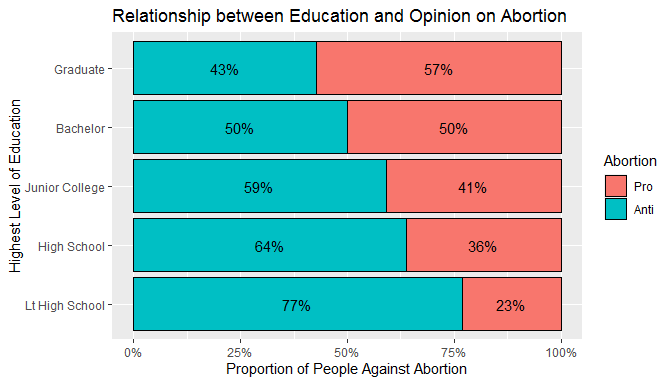
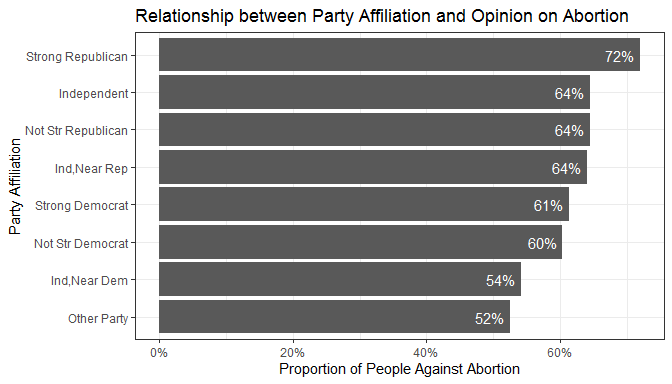
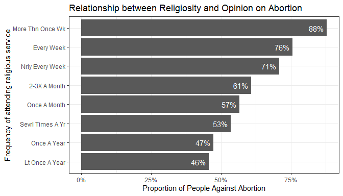

## Setup

### Load packages


```r
library(ggplot2)
library(dplyr)
library(statsr)
library(reshape2)
```

### Load data

Make sure your data and R Markdown files are in the same directory. When loaded
your data file will be called `gss`. Delete this note when before you submit 
your work. 


```r
load("gss.Rdata")
```


* * *

## Part 1: Data

Generalizability: 
Each survey from 1972 to 2004 was an independently drawn sample of English-speaking persons 18 years of age or over, living in non-institutional arrangements within the United States. Starting in 2006 Spanish-speakers were added to the target population. Full probability sampling (with random selection) was employed only in half of the 1975 and 1976 surveys and then 1977 onward. Before this, block quota sampling was used. 

Since the sample for the GSS is a cluster sample, standard errors are larger for the GSS than simple random sample calculations. Therefore, without applying the appropriate corrections for the design, there are reservations in generalizing to the entire population. 

Causality: 
Since this is simply an observational study, with no treatment/random assignment applied to the population, causality cannot be interpreted from the variables.  

* * *

## Part 2: Research question

> Is there a relationship between a person's opinion on abortion (ABANY) and   
a) Their highest level of education (DEGREE)  
b) Political party affiliation (PARTYID)  
c) How often someone attends religious service (ATTEND)  

The reason this research question is important to me is because of two reasons: 
1) I am strong advocate for women's rights and am pro-abortion
2) States across the U.S passed bills in 2019 make abortion past six weeks into pregnancy illegal

I am interested in researching whether anti-abortion opinion and education/party affiliation/religion are dependent. The reason that I have chosen these three variables to conduct my hypothesis tests is because I want to understand this demographic on three levels - personal (highest level of education), political (party), and social (religion). This will help with creating effective communication strategies (the targeting, the messaging) to inform people on this important women's right. 

* * *

## Part 3: Exploratory data analysis


```r
data <- gss %>% 
  select(year,abany,degree,partyid,relig,attend) %>%
  filter(!is.na(degree)) %>% 
  filter(!is.na(partyid)) %>%
  filter(!is.na(relig)) %>% 
  filter(!is.na(attend)) %>% 
  filter(!is.na(abany)) %>%
  mutate(antiabcode = if_else((abany=="No"),1,0))

degree_summary <- data %>% 
  select(degree,antiabcode) %>%
  group_by(degree) %>%
  summarize_at(vars(antiabcode),funs(prop_anti_abortion=mean,count=n()))
```

```
## Warning: funs() is soft deprecated as of dplyr 0.8.0
## Please use a list of either functions or lambdas: 
## 
##   # Simple named list: 
##   list(mean = mean, median = median)
## 
##   # Auto named with `tibble::lst()`: 
##   tibble::lst(mean, median)
## 
##   # Using lambdas
##   list(~ mean(., trim = .2), ~ median(., na.rm = TRUE))
## This warning is displayed once per session.
```

```r
degree_summary
```

```
## # A tibble: 5 x 3
##   degree         prop_anti_abortion count
##   <fct>                       <dbl> <int>
## 1 Lt High School              0.768  4955
## 2 High School                 0.638 13628
## 3 Junior College              0.590  1489
## 4 Bachelor                    0.5    3820
## 5 Graduate                    0.429  1848
```

```r
data %>% group_by(degree,abany) %>% 
  summarise(n=n()) %>% mutate(pct = n/sum(n)) %>%
  ggplot(aes(x=degree,y=pct,fill=abany,label=paste0(round(pct*100),"%"))) + 
  geom_col(position= position_stack(), color = "black") + 
  geom_text(position=position_stack(vjust=.5)) + 
  coord_flip() + 
  scale_y_continuous(labels=scales::percent_format()) + 
  xlab("Highest Level of Education") + 
  ylab("Proportion of People Against Abortion") + 
  labs(title="Relationship between Education and Opinion on Abortion") + 
  scale_fill_discrete(name = "Abortion", labels = c("Pro","Anti"))
```

<!-- -->

We can see that the higher the educational degree achieved, the lesser the proportion of people who are anti-abortion. 


```r
party_summary <- data %>% 
  select(partyid,antiabcode) %>%
  group_by(partyid) %>%
  summarize_at(vars(antiabcode),funs(prop_anti_abortion=mean,count=n())) 
  

party_summary$partyid <- factor(party_summary$partyid,levels = party_summary$partyid[order(party_summary$prop_anti_abortion)])

party_summary
```

```
## # A tibble: 8 x 3
##   partyid            prop_anti_abortion count
##   <fct>                           <dbl> <int>
## 1 Strong Democrat                 0.614  4283
## 2 Not Str Democrat                0.603  5452
## 3 Ind,Near Dem                    0.541  2949
## 4 Independent                     0.644  3258
## 5 Ind,Near Rep                    0.640  2326
## 6 Not Str Republican              0.644  4445
## 7 Strong Republican               0.720  2718
## 8 Other Party                     0.524   309
```

```r
ggplot(party_summary,aes(x=partyid,y=prop_anti_abortion))+
  theme_bw()+ 
  geom_bar(stat="identity")+
  coord_flip()+
  xlab("Party Affiliation") + 
  ylab("Proportion of People Against Abortion") + 
  labs(title="Relationship between Party Affiliation and Opinion on Abortion")+
  geom_text(aes(label=paste0(round(prop_anti_abortion*100),"%")),hjust=+1.2,colour="white") +
  scale_y_continuous(labels = scales::percent)
```

<!-- -->


Thus, we can see that democrats are on the lower end of the spectrum when it comes to being anti-abortion, whereas Republicans are at the higher end. Surprisingly, Independent party affiliation has the second highest proportion of people against abortion. 


```r
rel_summary <- data %>% 
  select(attend,antiabcode) %>%
  group_by(attend) %>%
  summarize_at(vars(antiabcode),funs(prop_anti_abortion=mean,count=n())) 
  

rel_summary$attend <- factor(rel_summary$attend,levels = rel_summary$attend[order(rel_summary$prop_anti_abortion)])

rel_summary
```

```
## # A tibble: 8 x 3
##   attend           prop_anti_abortion count
##   <fct>                         <dbl> <int>
## 1 Lt Once A Year                0.457  2387
## 2 Once A Year                   0.473  4204
## 3 Sevrl Times A Yr              0.534  3876
## 4 Once A Month                  0.567  2233
## 5 2-3X A Month                  0.608  2775
## 6 Nrly Every Week               0.708  1683
## 7 Every Week                    0.756  6178
## 8 More Thn Once Wk              0.879  2404
```

```r
ggplot(rel_summary,aes(x=attend,y=prop_anti_abortion))+
  theme_bw()+ 
  geom_bar(stat="identity")+
  coord_flip()+
  xlab("Frequency of attending religious service") + 
  ylab("Proportion of People Against Abortion") + 
  labs(title="Relationship between Religiosity and Opinion on Abortion")+
  geom_text(aes(label=paste0(round(prop_anti_abortion*100),"%")),hjust=+1.2,colour="white") +
  scale_y_continuous(labels = scales::percent)
```

<!-- -->


There is clear correlation (not causation) between religiosity and opinion on Abortion, where higher frequency of attending religious service is associated with a larger proportion of anti-abortion opinions. 

* * *

## Part 4: Inference

We will use the chi-square test for a two way table to test independence in each of the three cases. The chi-square test calculates a chi-square test statistic and a corresponding p-value. The p-value is the probability of obtaining a sample with observed counts given that the null hypothesis is true. If the p-value is lower than 0.05, we are able to reject the null hypothesis. 

Since I am not calculating the difference between 2 proportions, rather researching the dependency between two variables, I have not created confidence intervals. 

> 1) Is there a relationship between abortion opinion and highest level of education achieved? 

The hypotheses are as follows: 

H0: Abortion opinion and education are independent variables  
HA: Abortion opinion and education are dependent variables  

Conditions to check before performing chi-square test:  
a) Independence - Each case that contributes a count to the table must be independent of all other cases in the table   
b) Sample size - Each cell must have at least 5 expected cases  

We can confirm that the respondents have been randomly sampled, therefore each case is independent of the others. Sample size condition is satisfied as well, as seen from the table of counts below.  


```r
degree_table <- data %>% 
  select(degree,abany) 
  
table(degree_table$degree,degree_table$abany)
```

```
##                 
##                   Yes   No
##   Lt High School 1149 3806
##   High School    4933 8695
##   Junior College  610  879
##   Bachelor       1910 1910
##   Graduate       1056  792
```

```r
chisq.test(degree_table$degree,degree_table$abany,correct=FALSE)
```

```
## 
## 	Pearson's Chi-squared test
## 
## data:  degree_table$degree and degree_table$abany
## X-squared = 1009.2, df = 4, p-value < 2.2e-16
```

Since p-value is lesser than 0.05, we can reject the null hypothesis and conclude that the data provides strong evidence that the highest level of education and opinion on abortion are dependent. In other words, given that the variables are independent, the probability of collecting a sample with the observed counts is almost 0. 


> 2) Is there a relationship between abortion opinion and party affiliation? 

The hypotheses are as follows: 

H0: Abortion opinion and party affiliation are independent variables  
HA: Abortion opinion and party affiliation are dependent variables   

Conditions to check before performing chi-square test:  
a) Independence - Each case that contributes a count to the table must be independent of all other cases in the table  
b) Sample size - Each cell must have at least 5 expected cases  

We can confirm that the respondents have been randomly sampled, therefore each case is independent of the others. Sample size condition is satisfied as well, as seen from the table of counts below.  


```r
party_table <- data %>% 
  select(partyid,abany) 
  
table(party_table$partyid,party_table$abany)
```

```
##                     
##                       Yes   No
##   Strong Democrat    1655 2628
##   Not Str Democrat   2163 3289
##   Ind,Near Dem       1353 1596
##   Independent        1159 2099
##   Ind,Near Rep        837 1489
##   Not Str Republican 1582 2863
##   Strong Republican   762 1956
##   Other Party         147  162
```

```r
chisq.test(party_table$partyid,party_table$abany,correct=FALSE)
```

```
## 
## 	Pearson's Chi-squared test
## 
## data:  party_table$partyid and party_table$abany
## X-squared = 233.28, df = 7, p-value < 2.2e-16
```


Since p-value is lesser than 0.05, we can reject the null hypothesis and conclude that the data provides strong evidence that party affiliation and opinion on abortion are dependent. In other words, given that the variables are independent, the probability of collecting a sample with the observed counts is almost 0. 


> 3) Is there a relationship between abortion opinion and frequency of attending religious service? 

The hypotheses are as follows: 

H0: Abortion opinion and frequency of attending religious service are independent variables  
HA: Abortion opinion and frequency of attending religious service are dependent variables   

Conditions to check before performing chi-square test:  
a) Independence - Each case that contributes a count to the table must be independent of all other cases in the table  
b) Sample size - Each cell must have at least 5 expected cases  

We can confirm that the respondents have been randomly sampled, therefore each case is independent of the others. The sample size condition is also met as seen from the table below.  


```r
relig_table <- data %>% 
  select(attend,abany) 

table(droplevels(relig_table$attend),relig_table$abany)
```

```
##                   
##                     Yes   No
##   Lt Once A Year   1296 1091
##   Once A Year      2214 1990
##   Sevrl Times A Yr 1805 2071
##   Once A Month      968 1265
##   2-3X A Month     1088 1687
##   Nrly Every Week   491 1192
##   Every Week       1505 4673
##   More Thn Once Wk  291 2113
```

```r
chisq.test(relig_table$attend,relig_table$abany,correct=FALSE)
```

```
## 
## 	Pearson's Chi-squared test
## 
## data:  relig_table$attend and relig_table$abany
## X-squared = 2037.6, df = 7, p-value < 2.2e-16
```

Since p-value is lesser than 0.05, we can reject the null hypothesis and conclude that the data provides strong evidence that frequency of attending religious service and opinion on abortion are dependent. In other words, given that the variables are independent, the probability of collecting a sample with the observed counts is almost 0. 
